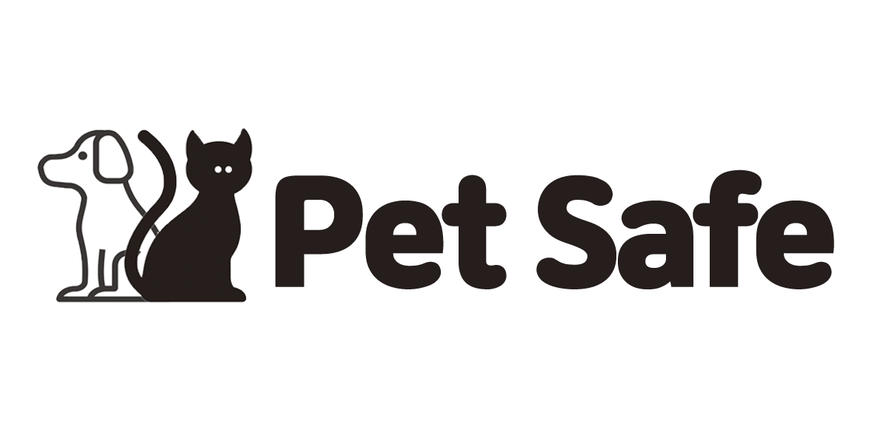

# PetSafe
### 반려동물 케어를 도와주는 APP & WEB🐶
기사를 보다보면 집안에서 일어나는 화재사고의 원인이 반려동물로 인해 종종 일어난다는 사실을 확인할 수 있었습니다.
이에 대해 반려동물이 위험한 곳으로 가면 알림이 오는 제품이 있으면 사고 발생 전에 예방 할 수 있겠다는 생각이 들어 **반려동물 케어 APP과 WEB**을 구현하고자 하였습니다.

[📃Notion](https://www.notion.so/bomne13/PET-SAFE-1c2cd7e4761543a9bc83b820987220e6)

## Member
Name|Role&Commit
---|---|

정은혜
|📌 [Role]() 📃 [Commit Log]()|

안승연
|📌 [Role]() 📃 [Commit Log]()|

유민우
|📌 [Role]() 📃 [Commit Log]()|
